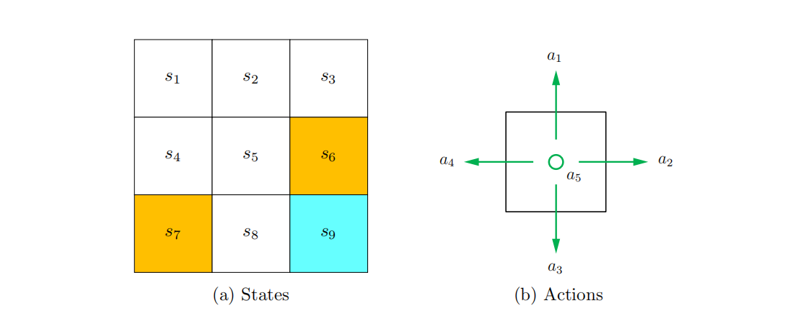

## 1.2 状态和行动

首先需要介绍的概念是状态(state)，它描述了智能体相对于环境的状态。在网格世界的例子中，状态相当于智能体的位置。既然是九宫格，当然也会有九种状态。它们被表示为图$1.3(a)$中的$s_1,s_2,...,s_9$，状态的集合被叫做状态空间(state space)，用符号表示为$\mathcal{S}=\{s_{1},\ldots,s_{9}\}。$

对于每个状态，智能体会采取五个可能的行动(action)：向前，向右，向后，向左和静止不动。这五个行动分别被表示为$a_1,a_2,...,a_5$(如图1.3(b)中所示)。不同的状态可以有不同的行动空间，表示为$\mathcal{A}=\{a_{1},\ldots,a_{5}\}$。例如，在$s_1$的状态下采取$a_1$或$a_4$会导致与边界(boundary)发生碰撞，我们可以设置$s_1$的行动空间为$\mathcal{A}(s_1)=\{a_{2},a_3,a_{5}\}$。在这本书中，我们考虑最一般的情况: $\mathcal{A}(s_i)=\mathcal{A}={a_{1},\ldots,a_{5}}$对于所有$i$。

 

 > 图1.3 状态和行动的图解，这里有九个状态${s_1,...,s_9}$，每个状态有五个可能的行动${a_1,a_2,a_3,a_4,a_5}$。