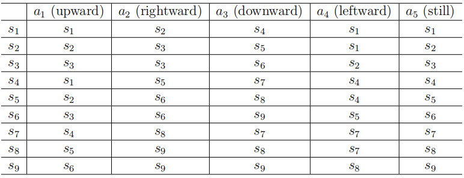

## 1.3 State transition

当采取一次action时，智能体可能会从一个状态变为另外一个状态。这样一个过程被称为*state transition*。例如，如果一个在状态$s_1$的智能体采取了action $a_2$(也就是往右走)，那么此时智能体将会移动到状态$s_2$，这样一个过程可以表示如下:

$$s_1\xrightarrow{a_2}s_2$$

我们接下来观察两个重要的例子。

- 当智能体尝试跃出boundary时，下一步的state是什么，例如，在$s_1$时采取$a_1$(也就是向上走)。答案是智能体将会bounced back因为智能体不能跃出state space。因此，我们有$s_1\xrightarrow{a_1}s_1$。
- 当智能体视图进入禁区时下一步的state是什么(forbidden cell)？例如在$s_5$采取$a_2$。在这里要分析两种不同的情况。在第一种情况下，尽管$s_6$是禁区，但是他仍然是可访问的。这种情况下，下一个state就是$s_6$。因此state transition就是$s_5\xrightarrow{a_2}s_6$。在第二种情况下，$s_6$是不可访问的，在这种情况下，智能体在尝试采取$a_2$时将会bounced back回到$s_5$，因此这时候的state transition就是$s_5\xrightarrow{a_2}s_5$。
- 我们应该考虑哪种情况？答案取决于现实环境。在本书中，我们考虑第一种禁区可以被访问的情景，尽管进入禁区会被惩罚。这种场景是更加一般化并且有趣的场景。此外，由于我们考虑的是模拟任务，因此无论我们倾向于哪种情况，我们都将对状态转换过程进行网络化。在实际情况的应用中，状态转换过程是由动态的现实世界决定的。

每个state及其相关actions定义了state transition过程。这个过程在表1.1中有所描述。在这个表中，每一行代表一个state，每一列代表一个action。每一个单元格表示当智能体在对应的state采取了action后，要过渡到的下一个state。

 

 > 表1.1 state transition过程的表格表示。每个单元格表示智能体在某一state下采取行动后要过渡到的下一个state。

从数学上，state transition过程可以用条件概率进行表示，例如对于$s_1$和$a_2$，条件概率分布如下 

$$\begin{cases}&p(s_1|s_1,a_2)=0,\\&p(s_2|s_1,a_2)=1,\\&p(s_3|s_1,a_2)=0,\\&p(s_4|s_1,a_2)=0,\\&p(s_5|s_1,a_2)=0,\end{cases}$$

这表明，在$s_1$时采取$a_2$，智能体移动到$s_2$的概率为1，移动到其他states的概率为0。因此在$s_1$处采取$a_2$无疑将会使智能体转移到$s_2$，关于条件概率的预备知识在附录A中提到，我们强力建议读者熟悉概率论，这是强化学习所必要的。

表格表示法虽然直观，但只能描述确定性的state transition。一般来说，state transition可能是随机的，必须用条件概率分布来表示。例如，当一阵随机的风吹过网格时，如果在$s_1$处采取$a_2$，智能体有可能会被吹到$s_5$，而不是$s_2$。在这种情况下，我们的$p(s_5|s_1,a_2)>0$。尽管如此，为了简单起见，我们在书中仅考虑网格世界实例中的确定性(deterministic)。