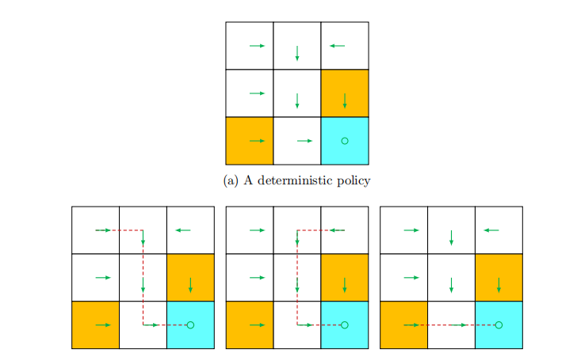
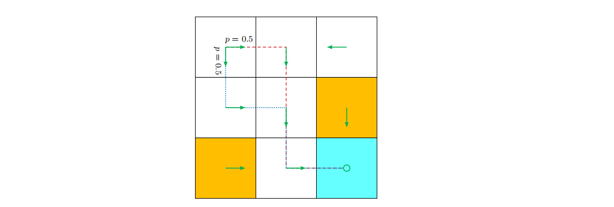
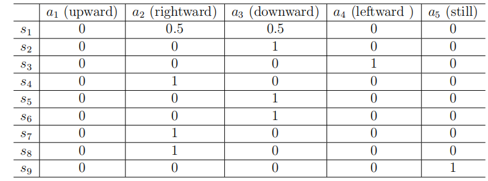

## 策略(Policy)

策略(policy)告诉了智能体在每一个状态下应该采取什么行动，策略可以被直观描述为图$1.4(b)$中的箭头。遵循策略，智能体可以产生一个从初始状态开始的轨迹(如图$1.4(b)$所示)。

 
 > 图1.4 用箭头和从不同初始状态出发得到的一些轨迹来表示一个策略。

数学上，策略可以用条件概率进行描述。将图$1.4$中的策略描述为$\pi(a|s)$，这是一个为每个状态定义的条件概率分布函数。例如，状态$s_1$的策略是:

$$\begin{gathered}\pi(a_1|s_1)=0,\\\pi(a_{2}|s_{1})=1,\\\pi(a_3|s_1)=0,\\\pi(a_4|s_1)=0,\\\pi(a_{5}|s_{1})=0,\end{gathered}$$

这表示在状态$s_1$下采取行动$a_2$的概率是$1$，而采取其他动作的概率为$0$。

上面的政策是确定性的(deterministic)。但是一般来说，策略是随机的(stochastic)。例如，在图1.5这种展示的策略就是随机的: 在状态$s_1$下，智能体可能采取行动来向右或者向下。采取这两个行动的概率是相同的(都是0.5)。在这种情况下，状态$s_1$的策略是

$$\begin{gathered}\pi(a_1|s_1)=0,\\\pi(a_{2}|s_{1})=0.5,\\\pi(a_3|s_1)=0.5,\\\pi(a_4|s_1)=0,\\\pi(a_{5}|s_{1})=0,\end{gathered}$$

 
 > 图1.5 一个随机策略。在状态$s_1$中，智能体可能向右移动，也可能向下移动，概率均为$0.5$。

以条件概率表示的策略可以表格形式存储。例如，表1.2表示图1.5所示的随机策略。第$i$行和第$j$列的条目是在第$i$个状态下采取第$j$个行动的概率。这种表示法称为表格表示法(tabular representation)。我们将在第 8 章中介绍另一种将策略表示为参数化函数的方法。

 
 > 表1.2 一个策略的表格表示法。每一个条目代表当前状态下采取对应行动的概率。