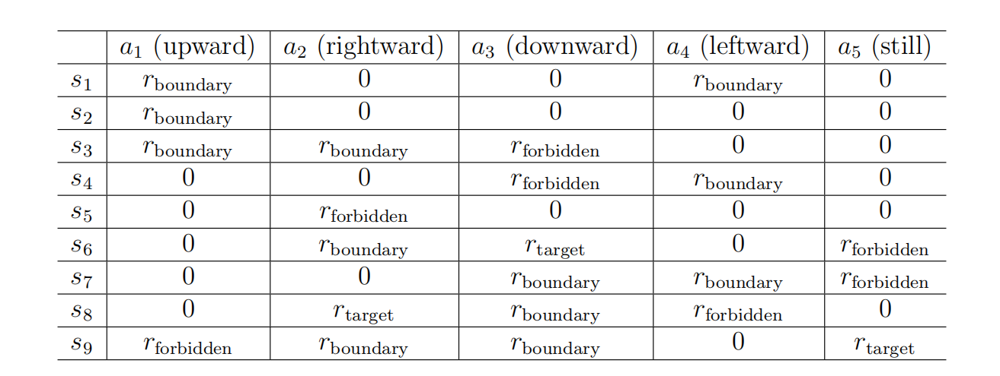

## 奖励(Reward)

奖励(Reward)是强化学习中最重要的概念之一。

在某一状态下执行一项行动后，智能体会从环境反馈中获得奖励，用$r$表示。奖励是状态$s$和行动$a$的函数。在这里，我们将其表示为$r(s,a)$，其数值可以为正数、负数或者为零。不同的奖励对于智能体最终学习到的策略具有不同的影响。通常来说，对于正奖励，我们鼓励智能体采取相应行动；对于负奖励，我们鼓励智能体不采取该行动。

在网格世界例子中，奖励设计如下:

- 如果智能体尝试跃出边界，则$r_{boundary}=-1$
  
- 如果智能体尝试进入禁区，则$r_{forbidden}=-1$
  
- 如果智能体到达目标状态，则$r_{target}=+1$
  
- 其他，智能体获得的奖励为$r_{other}=0$

应特别注意目标状态$s_9$。奖励过程并不必须在智能体到达$s_9$后终止。如果智能体在$s_9$采取行动$a_5$，下一个状态还是$s_9$，奖励为 $r_{target}=+1$。如果智能体采取$a_2$行动，下一个状态也是$s_9$，但奖励是$r_{boundary}=+1$。

奖励可以被理解为一种人机界面(human-machine interface)，我们可以用它来引导智能体按照我们的期望行事。例如，通过上面设计的奖励，我们可以让智能体倾向于避免离开边界或踏入禁区。设计适当的奖励是强化学习的重要一步。不过对于复杂的任务来说，这一步并不简单，因为它可能需要我们对给定问题有很好的理解
。尽管如此，这仍比使用其他需要专业背景或对给定问题有深刻理解的方法来解决问题要容易得多。

执行动作后获得奖励的过程可以直观地表示为表1.3。表格的每一行对应一个状态，每
列对应一个行动。表中每个单元格中的值表示在某一状态下采取某一行动所能得到的奖励。

初学者可能会问这样一个问题：如果给定了奖励表，我们能通过简单地选择奖励最大的行动来找到好的策略吗？答案是否定的。这是因为这些奖励都是即时奖励，可以在采取行动后获得。要确定一个好的政策，我们必须考虑长期获得的总奖励(更多信息请参见第 1.6 节)。即时回报最大的行动未必会带来最大的总回报。

!!! note 
    我理解的是局部最优不代表全局最优

虽然直观，但表格表示法只能描述确定性的
奖励过程。一种更普遍的方法是使用条件概率$p(r|s,a)$来描述奖励过程。例如，对于状态$s_1$，我们有:

$$p(r=-1|s_{1},a_{1})=1,\quad p(r\neq-1|s_{1},a_{1})=0.$$

 
 >  以表格表示获取奖励的过程。在这里，过程是确定的。每个单元格表示智能体在给定状态下采取行动后可以获得多少奖励。

这意味着，当我们在$s_1$处采取$a_1$，智能体肯定会获得$r=-1$。在这个例子中，奖励过程是确定(deterministic)。但一般来说，它应该是随机的(stochastic)。例如，学习努力的一个学生，他/她会收到一个正向的奖励(例如在考试中取得更高的成绩)，但是奖励的值是不确定的。