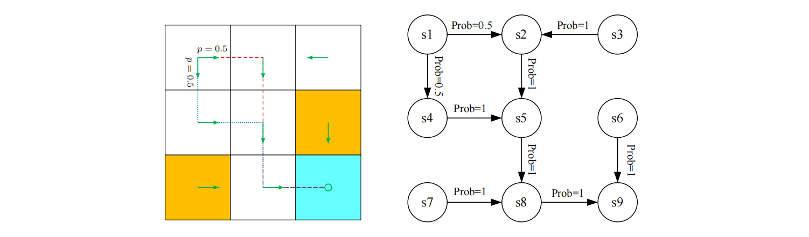

## 马尔科夫决策过程(Markov decision processes)

本章前几节通过实例说明了强化学习的一些基本概念。本节将在马尔可夫决策过程(MDP)的框架下，以更正式的方式介绍这些概念。

马尔可夫决策过程是描述随机动态系统的一般框架。马尔可夫决策过程的关键要素如下：

1. 集合:
     - 状态空间:状态的结合，记为$\mathcal{S}$。
     - 行动空间:行动的集合，记为$\mathcal{A}(s)$，其中$s \in \mathcal{S}$。
     - 奖励集合:与每个状态-行动对$(s,a)$相关联的奖励集合，用$R(s，a)$表示。
2. 模型:
     - 状态转移概率: 在状态$s$下，当采取行动$a$时，转变为状态$s'$的概率为$p(s'|s,a)$。对于任意$(s,a)$有$\sum_{s^{\prime}\in\mathcal{S}}p(s^{\prime}|s,a)=1$。
     -  奖励概率: 在状态$s$下，当采取行动$a$时，获得奖励$r$的概率为$p(r|s,a)$。对于任意$(s,a)$有$\sum_{r\in\mathcal{R}(s,a)}p(r|s,a)=1$
3. 策略: 在状态$s$下，采取行动$a$的概率为$\pi(a|s).$对于任意$s \in \mathcal{S}$有$\sum_{r\in\mathcal{R}(s,a)}p(r|s,a)=1$。
4. 马尔可夫性质: 马尔可夫特性是指随机过程的无记忆特性。在数学上，它意味着

$$p(s_{t+1}|s_t,a_t,s_{t-1},a_{t-1},\ldots,s_0,a_0)=p(s_{t+1}|s_t,a_t),$$

$$p(r_{t+1}|s_t,a_t,s_{t-1},a_{t-1},\ldots,s_0,a_0)=p(r_{t+1}|s_t,a_t),\tag{1.4}$$

其中$t$代表当前时间步长，$t+1$代表下一个时间步长。式子(1.4)表明，下一个状态或奖励仅取决于当前的状态和行动，与前一个状态和行动无关。马尔可夫特性对于推导MDP的基本贝尔曼方程非常重要，在下章我们会详细说明。

这里，$p(s'|s,a)$和$p(r|s,a)$对于所有$(s, a)$称为模型(model)或动态(dynamics)。模型可以是不变的(stationary)，也可以是可变的(nonstationary)换句话说，时间不变和时间变的。不变模型不会随时间变化；可变模型可能会随时间变化。例如，在网格世界的例子中，如果一个禁区时而出现，时而消失，那么这个模型就是可变的。在本书中，我们只考虑不变模型。

人们可能听说过马尔可夫过程(MP)。马尔可夫决策过程和马尔可夫过程有什么区别呢？答案是，一旦马尔可夫决策过程中的策略固定下来，马尔可夫决策过程就会退化为马尔可夫过程。例如，图1.7中的网格世界示例可抽象为马尔可夫过程。在有关随机过程的文献中，如果一个马尔科夫过程是离散时间过程，且状态的数量是有限或可数的，则该过程也称为马尔科夫链。在本书中，当上下文明确时，“马尔可夫过程 ”和 “马尔可夫链 ”这两个术语可以互换使用。此外，本书主要考虑状态数和行动数都是有限的有限马尔可夫决策过程。这是最简单的情况，应予以充分理解。

 
 > 图1.7: 将网格世界示例抽象为马尔可夫过程。在这里，圆圈代表状态，带箭头的链接代表状态转移。

最后，强化学习可以被描述为一个智能体与环境交互的过程。智能体是一个决策者，可以感知自身状态、维护策略并执行。智能体之外的一切都被视为环境。在网格世界的例子中，智能体和环境分别对应于机器人和网格世界。在智能体决定采取行动后，执行器会执行这样的决定。然后，智能体的状态将发生变化，并获得奖励。通过使用解释器，智能体可以解释新的状态和奖励。这样，一个闭环就形成了。

