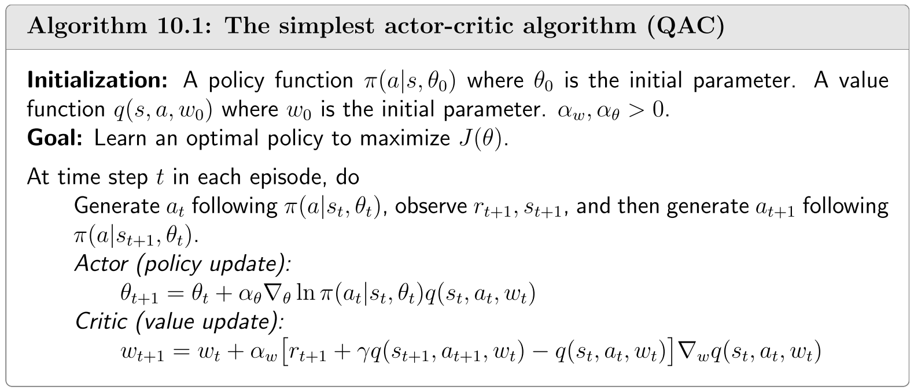

## 10.1 最简单的演员-评论家方法

本节介绍最简单的演员-评论家方法。该算法可通过扩展式$(9.32)$的策略梯度算法直接获得。

回顾策略梯度法的核心思想是通过最大化标量指标$J(\theta)$来搜索最优策略。用于最大化$J(\theta)$的梯度上升算法可表示为

$$\begin{aligned}\theta_{t+1}&=\theta_t+\alpha\nabla_\theta J(\theta_t)\\&=\theta_{t}+\alpha\mathbb{E}_{S\sim\eta,A\sim\pi}\left[\nabla_{\theta}\ln\pi(A|S,\theta_{t})q_{\pi}(S,A)\right],\end{aligned}\tag{10.1}$$

其中$\eta$表示状态分布(详见定理$9.1$)。由于真实梯度未知，可采用随机梯度进行近似:

$$\theta_{t+1}=\theta_t+\alpha\nabla_\theta\ln\pi(a_t|s_t,\theta_t)q_t(s_t,a_t).\tag{10.2}$$

!!! note
    把一个含有期望的算法，变为一个采样的不含期望的算法

该算法由式$(9.32)$给出。

方程$(10.2)$具有重要意义，因为它清晰地展示了如何将基于策略的方法与基于价值的方法相结合。一方面，这是一个基于策略的算法，因为它直接更新策略参数$\theta$。另一方面，该方程需要已知 $q_t(s_t, a_t)$——即对行动值 $q_\pi(s_t, a_t)$的估计值。因此，需要另一个基于价值的算法来生成 $q_t(s_t, a_t)$。截至目前，本书已探讨了两种估计动作值的方法：第一种基于蒙特卡洛学习，第二种则是时序差分(TD)学习。

- 若通过蒙特卡洛学习估计$q_\pi(s_t, a_t)$，则对应算法称为REINFORCE或蒙特卡洛策略梯度，该算法已在第$9$章进行过介绍。

- 若通过时序差分(TD)学习估计$q_t(s_t, a_t)$，相应算法通常称为演员-评论性方法。因此，将基于TD的价值估计融入策略梯度方法，即可得到演员-评论性算法。

最简单的演员-评论性算法流程如算法$10.1$所示。其中评论性部分对应基于$(8.35)$式Sarsa算法的价值更新步骤，其动作价值通过参数化函数$q(s,a,\mathbf{w})$表示；演员部分则对应$(10.2)$式的策略更新步骤。该算法有时被称为Q 演员-评论性(QAC)算法。虽然结构简单，但QAC揭示了演员-评论性方法的核心思想，后续章节将展示其如何扩展形成多种进阶算法。

 

 > 算法$10.1$：最简单的演员-评论性算法(QAC)