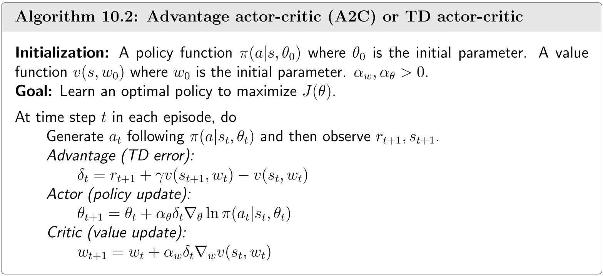

## 10.2 优势演员-评论家方法

现在我们介绍优势演员-评论家算法。该算法的核心思想是通过引入基线来降低估计方差。

### 10.2.1 基准不变性

策略梯度的一个有趣性质是它对附加基线的变化具有不变性。即

$$\mathbb{E}_{S\sim\eta,A\sim\pi}\left[\nabla_{\theta}\ln\pi(A|S,\theta_{t})q_{\pi}(S,A)\right]=\mathbb{E}_{S\sim\eta,A\sim\pi}\left[\nabla_{\theta}\ln\pi(A|S,\theta_{t})(q_{\pi}(S,A)-b(S))\right],\tag{10.3}$$

其中附加基线$b(S)$是状态$S$的标量函数。接下来我们针对该基线回答两个问题。

- 首先，为什么式$(10.3)$成立？

    当且仅当下式成立时，方程$(10.3)$成立：

    $$\mathbb{E}_{S\sim\eta,A\sim\pi}\left[\nabla_\theta\ln\pi(A|S,\theta_t)b(S)\right]=0.$$

    该方程成立的条件是

    $$\begin{aligned}\mathbb{E}_{S\sim\eta,A\sim\pi}\left[\nabla_{\theta}\ln\pi(A|S,\theta_{t})b(S)\right]&=\sum_{s\in\mathcal{S}}\eta(s)\sum_{a\in\mathcal{A}}\pi(a|s,\theta_{t})\nabla_{\theta}\ln\pi(a|s,\theta_{t})b(s)\\&=\sum_{s\in\mathcal{S}}\eta(s)\sum_{a\in\mathcal{A}}\nabla_{\theta}\pi(a|s,\theta_{t})b(s)\\&=\sum_{s\in\mathcal{S}}\eta(s)b(s)\sum_{a\in\mathcal{A}}\nabla_{\theta}\pi(a|s,\theta_{t})\\&=\sum_{s\in\mathcal{S}}\eta(s)b(s)\nabla_\theta\sum_{a\in\mathcal{A}}\pi(a|s,\theta_t)\\&=\sum_{s\in\mathcal{S}}\eta(s)b(s)\nabla_{\theta}1=0.\end{aligned}$$

- 其次，基线为何有用？

    基线(baseline)的作用在于能够降低使用样本近似真实梯度时的近似方差。具体而言，设

    $$X(S,A)\doteq\nabla_\theta\ln\pi(A|S,\theta_t)[q_\pi(S,A)-b(S)].\tag{10.4}$$

    那么，真实的梯度为$\mathbb{E}[X(S, A)]$。由于我们需要使用随机样本$x$来近似$\mathbb{E}[X]$，因此若方差$\operatorname{var}(X)$较小则更为有利。例如，当$\operatorname{var}(X)$接近于零时，任何样本$x$都能准确逼近$\mathbb{E}[X]$；反之，若$\operatorname{var}(X)$较大，则样本值可能与$\mathbb{E}[X]$存在显著偏差。

    尽管期望值$\mathbb{E}[X]$对基线不敏感，但方差$\text{var}(X)$并非如此。我们的目标是设计一个优良的基线以最小化$\text{var}(X)$。在REINFORCE和QAC算法中，我们设定$b =0$，但这并不能保证是最优基线。

    事实上，使$\text{var}(X)$最小化的最优基线为

    $$b^*(s)=\frac{\mathbb{E}_{A\sim\pi}\left[\|\nabla_\theta\ln\pi(A|s,\theta_t)\|^2q_\pi(s,A)\right]}{\mathbb{E}_{A\sim\pi}\left[\|\nabla_\theta\ln\pi(A|s,\theta_t)\|^2\right]},\quad s\in\mathcal{S}.\tag{10.5}$$

    证明过程见Box 10.1。

    尽管$(10.5)$中的基线是最优的，但其复杂度过高而难以实际应用。若从$(10.5)$中移除权重$\|\nabla_\theta \ln \pi(A|s, \theta_t)\|^2$，则可得到一个具有简洁表达式的次优基线：

    $$b^\dagger(s)=\mathbb{E}_{A\sim\pi}[q_\pi(s,A)]=v_\pi(s),\quad s\in\mathcal{S}.$$

    有趣的是，这一非最优基线正是状态值。

### 10.2.2 算法描述

当$b(s) = v_\pi(s)$时，$(10.1)$中的梯度上升算法变为

$$\begin{gathered}\theta_{t+1}=\theta_{t}+\alpha\mathbb{E}\left[\nabla_{\theta}\ln\pi(A|S,\theta_{t})[q_{\pi}(S,A)-v_{\pi}(S)]\right]\\\doteq\theta_t+\alpha\mathbb{E}\left[\nabla_\theta\ln\pi(A|S,\theta_t)\delta_\pi(S,A)\right].\end{gathered}\tag{10.7}$$

在这里

$$\delta_\pi(S,A)\doteq q_\pi(S,A)-v_\pi(S)$$

该函数被称为**优势函数**，用于衡量某一行动相对于其他行动的优势。具体而言，注意到$v_\pi(s) = \sum_{a\in\mathcal{A}} \pi(a|s)q_\pi(s, a)$表示行动值的均值。若$\delta_\pi(s, a) >0$，则表明对应行动值高于均值。

$(10.7)$式的随机版本为

$$\begin{aligned}\theta_{t+1}&=\theta_t+\alpha\nabla_\theta\ln\pi(a_t|s_t,\theta_t)[q_t(s_t,a_t)-v_t(s_t)]\\&=\theta_t+\alpha\nabla_\theta\ln\pi(a_t|s_t,\theta_t)\delta_t(s_t,a_t),\\&=\theta_t+\alpha\underbrace{\left(\frac{\delta_t(s_t,a_t)}{\pi(a_t|s_t,\theta_t)}\right)}_{\mathrm{step~size}}\nabla_\theta\pi(a_t|s_t,\theta_t)\end{aligned}\tag{10.8}$$

!!! note
    可以看到，这种stochastic gradient的方法可以很好的平衡探索和利用

    步长与$\delta_t$成比例，而不是与绝对值$q_t$成比例，当$\delta_t$较大时，步长也会变大，那么朝着那个方向走的也会变多，因此$\pi(a_t|s_t)$也会变大。通俗来说就是，我知道当前这个动作会有比较大的动作值，那么下个时刻就要给更大的概率去选择它，这就是充分利用。

    如果分母对应的策略较小，那么步长也会变大，所得到下一时刻的$\pi$的概率也会比较大，通俗来说，上一时刻我选择这个行动的概率较小，但下一时刻我会给选择这个行动更大的概率，从而增加探索。

其中$s_t$,$a_t$分别为时刻$t$时状态空间$\mathcal{S}$与动作空间$\mathcal{A}$的采样值。此处$q_t(s_t,a_t)$和 $v_t(s_t)$分别是对$q_{\pi(\theta_t)}(s_t,a_t)$和$v_{\pi(\theta_t)}(s_t)$的近似估计。式$(10.8)$中的算法基于$q_t$相对于$v_t$的相对值(而非$q_t$的绝对值)进行策略更新。这种设计具有直观合理性——因为在给定状态下选择动作时，我们仅需关注哪个动作具有相对于其他动作的最大价值。

若通过蒙特卡洛学习估计$q_t(s_t, a_t)$和$v_t(s_t)$，则式$(10.8)$中的算法称为带基线的REINFORCE。若通过时序差分(TD)学习估计$q_t(s_t, a_t)$和$v_t(s_t)$，该算法通常称为优势演员-评论家(A2C)。A2C的实现流程如算法$10.2$所示，需注意此实现中优势函数通过TD误差近似：

$$q_t(s_t,a_t)-v_t(s_t)\approx r_{t+1}+\gamma v_t(s_{t+1})-v_t(s_t).$$

该近似是合理的，因为

$$q_\pi(s_t,a_t)-v_\pi(s_t)=\mathbb{E}\left[R_{t+1}+\gamma v_\pi(S_{t+1})-v_\pi(S_t)|S_t=s_t,A_t=a_t\right],$$

根据 $q_\pi(s_t, a_t)$的定义，该式成立。采用时序差分（TD）误差的一个优势在于，我们仅需使用单一神经网络来表示 $v_\pi(s)$。反之，若设 $\delta_t = q_t(s_t, a_t) - v_t(s_t)$，则需要维护两个网络分别表征 $v_\pi(s)$和 $q_\pi(s, a)$。当采用TD误差时，该算法也可称为TD Actor-Critic。此外需注意，策略 $\pi(\theta_t)$具有随机性因而具备探索特性，因此无需依赖外部机制(如$\varepsilon$-贪婪)即可直接用于生成经验样本。A2C存在若干变体，例如异步优势演员-评论家(A3C)。感兴趣的读者可参阅[71,72]。

 

 > 算法$10.2$：优势演员-评论家(A2C)或时序差分演员-评论家