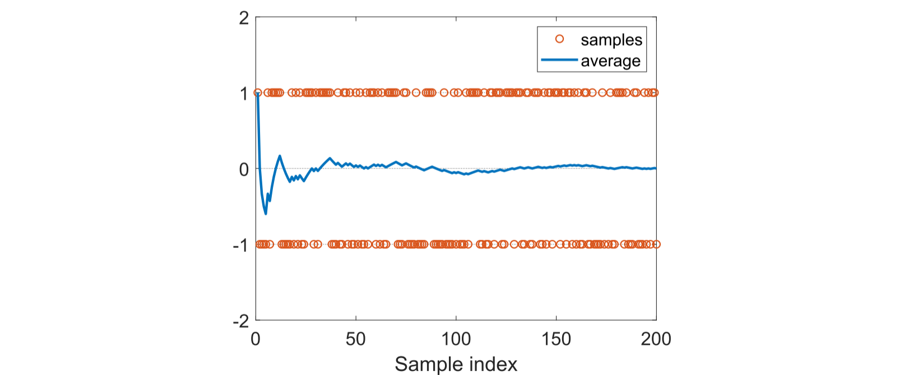

## 5.1 启发性示例: 期望值估计

接下来，我们介绍期望值估计问题，以展示如何从数据而非模型中学习。我们将看到，均值估计可以通过蒙特卡洛方法实现，这种方法是一类广泛使用的技术，它利用随机样本解决估计问题。读者可能会好奇，我们为什么关注均值估计问题。这仅仅是因为状态值和行动值都被定义为回报的均值。因此，估计一个状态值或动作值实际上就是一个均值估计问题。

考虑一个随机变量$X$，它可以取自一个有限的实数集合，记为$\mathcal{X}$。假设我们的任务是计算$X$的期望值：$E[X]$。有两种方法可以用来计算$E[X]$。

- 第一种方法是基于模型的。这里的模型指的是$X$的概率分布。如果模型已知，则可以根据期望值的定义直接计算出均值：

    $$\mathbb{E}[X]=\sum_{x\in\mathcal{X}}p(x)x.$$

    在这本书中，我们交替使用期望值、均值和平均值这些术语。

- 第二种方法是无模型方法。当$X$的概率分(即模型)未知时，假设我们有$X$的若干样本$\{x_1,x_2,...,x_n\}$。此时，均值可以近似为
    
    $$\mathbb{E}[X]\approx\bar{x}=\frac{1}{n}\sum_{j=1}^{n}x_{j}.$$

    当$n$较小时，这种近似可能不够准确。然而，随着$n$的增加，这种近似会变得越来越准确。当$n\to\infty$，我们有$\bar{x}\to E[X]$。

    这是由大数定律(law of large numbers)保证的：大量样本的平均值接近于期望值。大数定律在方框5.1节中介绍。

以下示例说明了上述两种方法。考虑一个抛硬币游戏。设随机变量$X$表示硬币落地时朝上的面。$X$有两个可能的取值：当正面朝上时$X = 1$，当反面朝上时$X=−1$。假设$X$的真实概率分布(即模型)为

$$p(X=1)=0.5,\quad p(X=-1)=0.5.$$

如果概率分布已知，我们可以直接计算均值为：

$$\mathbb{E}[X]=0.5\cdot1+0.5\cdot(-1)=0.$$

如果概率分布未知，那么我们可以多次抛掷硬币，并记录样本结果$\{x_i\}_{i=1}^n$。通过计算样本的平均值，我们可以得到均值的估计值。如图$5.2$所示，随着样本数量的增加，估计的均值会变得越来越准确。

 
 > 图$5.2$：一个演示大数定律的例子。这里，样本是从{+1,−1}中按照均匀分布抽取的。随着样本数量的增加，样本的平均值逐渐收敛到零，即真实的期望值。

值得一提的是，用于均值估计的样本必须是独立同分布的($i.i.d.$或$iid$)。否则，如果样本值之 间存在相关性，则可能无法正确估计期望值。一个极端情况是，所有样本值都与第一个样本相同，无论第一个样本是什么。在这种情况下，无论使用多少个样本，样本的平均值始终等于第一个样本。