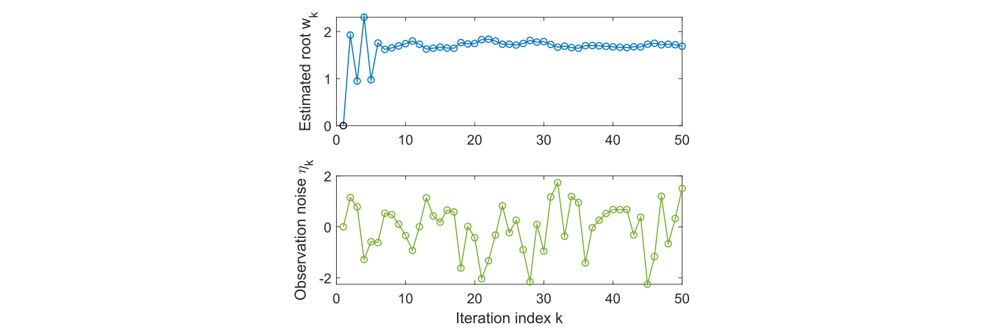

## 6.2 罗宾斯-门罗算法

随机逼近是指解决寻根或优化问题的一大类随机迭代算法[24]。与许多其他寻根(root-finding)算法如随机逼近法与梯度逼近法等相比，其强大之处在于无需表达目标函数或其导数。

罗宾斯-门罗(Robbins-Monro，RM)算法是随机逼近领域的一项开创性工作 [24-27]。如第$6.4$节所示，著名的随机梯度下降算法就是RM算法的一种特殊形式。接下来我们将介绍RM算法的细节。

假设我们想找出方程的根

$$g(w)=0,$$

其中$w\in\mathbb{R}$是未知变量，$g:\mathbb{R} \rightarrow \mathbb{R}$是一个函数。许多问题都可以表述为寻根问题。例如，如果$J(w)$是一个需要优化的目标函数，那么这个优化问题可以转换为求解$g(w)=\nabla_wJ(w)=0.$。此外，$g(w) = c$(其中$c$是一个常数)这样的方程也可以通过将$g(w)-c$改写为一个新函数而转换为上述方程。

如果已知$g$的表达式或其导数，就可以使用许多算法。然而，我们面临的问题是函数$g$的表达式是未知的。例如，函数可以用人工神经网络来表示，而人工神经网络的结构和参数都是未知的。此外，我们只能获得$g(w)$的噪声观测值：

$$\tilde{g}(w,\eta)=g(w)+\eta,$$

其中$\eta\in\mathbb{R}$是观测误差，可能是高斯误差，也可能不是。总之，这是一个黑盒系统，只有输入$w$和噪声输出$\tilde{g}(w,\eta)$是已知的(见图$6.2$)。我们的目标是利用$w$和$\tilde{g}$求解$g(w) = 0$。

 
 > 图$6.2$：由$w$和$\tilde{g}$求解 $g(w) = 0$问题的示意图。

能求解$g(w) = 0$的 RM 算法是

$$w_{k+1}=w_k-a_k\tilde{g}(w_k,\eta_k),\quad k=1,2,3,\ldots\tag{6.5}$$

其中，$w_k$是第$k$个根估计值，$\tilde{g}(w_k, \eta_k)$是第$k$个噪声观测值，$a_k$是正系数。可以看出，RM 算法不需要关于函数的任何信息。它只需要输入和输出。

 
 > 图$6.3$：RM 算法示例。

为了说明RM算法，请看一个$g(w) = w^3 - 5$的例子。真根为$5^{1/3} ≈ 1.71$。现在，假设我们只能观察到输入$w$和输出 $\tilde{g}(w) = g(w) + \eta$，其中$\eta$为$i.i.d.$，服从均值为$0$,标准差为$1$的标准正态分布，初始猜测为 $w_1 = 0$，系数为$a_k = 1/k$。$w_k$的变化过程如图$6.3$所示。即使观测结果受到噪声$\eta_k$的干扰，估计值$w_k$仍然可以收敛到真正的根值。需要注意的是，必须正确选择初始猜测$w_1$，以确保$g(w) = w^3 - 5$这一特定函数的收敛性。在下面的小节中，我们将介绍 RM 算法收敛于任何初始猜测的条件。