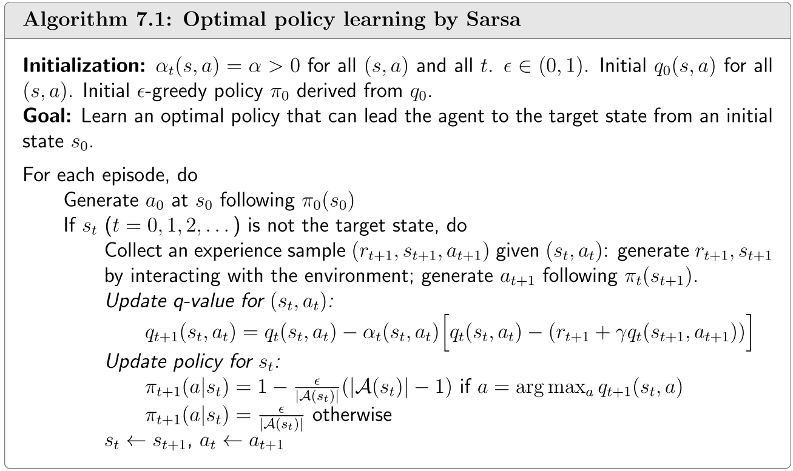
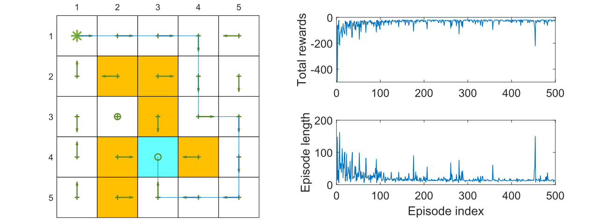

## 7.2 行动值估计:Sarsa算法

7.1节介绍的TD算法仅能估计状态值。本节将介绍另一种名为Sarsa的TD算法，该算法可直接估计行动值。行动值估计具有重要意义，因其可与策略改进步骤相结合来学习最优策略。

### 7.2.1算法描述

给定策略$\pi$，我们的目标是估计行动值。假设已有遵循$\pi$生成的若干经验样本：$(s_0, a_0, r_1, s_1, a_1, \ldots, s_t, a_t, r_{t+1}, s_{t+1}, a_{t+1}, \ldots)$。可采用以下Sarsa算法进行动作价值估计：

$$q_{t+1}(s_t,a_t)=q_t(s_t,a_t)-\alpha_t(s_t,a_t)\left[q_t(s_t,a_t)-(r_{t+1}+\gamma q_t(s_{t+1},a_{t+1}))\right],\tag{7.12}$$

$$q_{t+1}(s,a)=q_t(s,a),\quad\mathrm{for~all}(s,a)\neq(s_t,a_t),$$

其中 $t =0,1,2, \dots$，$\alpha_t(s_t, a_t)$为学习率。此处 $q_t(s_t, a_t)$是 $q_\pi(s_t, a_t)$的估计值。在时刻 $t$，仅更新 $(s_t, a_t)$的 $q$值，其余状态的 $q$值保持不变。

Sarsa算法的重要性质如下

- 该算法为何命名为"Sarsa"？这是因为其每次迭代都需要五元组 $(s_t, a_t, r_{t+1}, s_{t+1}, a_{t+1})$。Sarsa是"状态-动作-奖励-状态-动作"（state-action-reward-state-action）的缩写形式。该算法最早由文献[35]提出，其命名则由文献[3]确立。

- 为什么Sarsa要这样设计？读者可能已经注意到，Sarsa与(7.1)式中的TD算法非常相似。实际上，只需将TD算法中的状态值估计替换为行动值估计，就能直接推导出Sarsa算法。

- Sarsa算法的数学本质是什么？与(7.1)中的TD算法类似，Sarsa是一种用于求解给定策略贝尔曼方程的随机近似算法：

    $$q_\pi(s,a)=\mathbb{E}\left[R+\gamma q_\pi(S^{\prime},A^{\prime})|s,a\right],\quad\mathrm{for~all}(s,a).\tag{7.13}$$

    式$(7.13)$是以行动值函数表示的贝尔曼方程。具体证明见方框$7.3$。

- Sarsa算法是否收敛？由于Sarsa是$(7.1)$中TD算法的行动值函数版本，其收敛性结果与定理$7.1$相似，具体表述如下。

!!! info
    **定理7.2** (Sarsa算法的收敛性).给定策略 $\pi$，若对所有 $(s, a)$满足 $\sum_t \alpha_t(s, a) = \infty$且 $\sum_t \alpha^2_t(s, a) < \infty$，则通过 (7.12)式的 Sarsa算法，$q_t(s, a)$几乎必然收敛到行动值 $q_\pi(s, a)$（当 $t \to \infty$时）。

该证明过程与定理7.1类似，此处从略。需满足对所有状态-动作对$(s, a)$均有$\sum_t \alpha_t(s, a) = \infty$且$\sum_t \alpha_t^2(s, a) < \infty$的条件。特别地，$\sum_t \alpha_t(s, a) = \infty$要求每个状态-动作对必须被访问无限次（或足够多次）。在时刻$t$，若$(s, a) = (s_t, a_t)$，则$\alpha_t(s, a) >0$；否则$\alpha_t(s, a) =0$。

该证明过程与定理$7.1$类似，此处从略。需满足对所有状态-动作对$(s,a)$均有$\sum_t \alpha_t(s, a) = \infty$且$\sum_t \alpha_t^2(s, a) < \infty$的条件。特别地，$\sum_t \alpha_t(s, a) = \infty$要求每个状态-行动对必须被访问无限次(或足够多次)在时刻$t$，若$(s, a) = (s_t, a_t)$，则$\alpha_t(s, a) >0$；否则$\alpha_t(s, a) =0$。

### 7.2.2基于Sarsa算法的最优策略学习

(7.12)式中的Sarsa算法仅能估计给定策略的行动值。为寻找最优策略，可将其与策略改进步骤相结合。该组合方法通常仍称为Sarsa算法，其具体实现流程如算法7.1所示。

 
 > 算法$7.1$

如算法7.1所示，每次迭代包含两个步骤：第一步更新被访问状态-动作对的$q$值；第二步将策略更新为$\varepsilon$-贪婪策略。$q$值更新步骤仅针对时刻$t$访问的单个状态-行动对进行更新，随后立即更新状态$s_t$对应的策略。这意味着我们在策略更新前并未对给定策略进行充分评估，该设计基于广义策略迭代的思想。此外，策略更新后会立即用于生成下一个经验样本。此处采用的$\varepsilon$-贪婪策略具有探索性特征。

 
 > 图$7.2$：Sarsa算法的演示示例。所有训练回合均从左上角状态开始，并在到达目标状态（蓝色单元格）时终止。目标是找到从起始状态到目标状态的最优路径。奖励设置为 $r_{\text{target}} =0$，$r_{\text{forbidden}} = r_{\text{boundary}} = -10$，以及 $r_{\text{other}} = -1$。学习率 $\alpha =0.1$，$\epsilon$值为0.1。左图显示算法获得的最终策略，右图展示各训练回合的总奖励与路径长度。

图7.2展示了一个演示Sarsa算法的仿真示例。与本书之前讨论的所有任务不同，该任务的目标是从特定起始状态到目标状态寻找最优路径，而非为所有状态求解最优策略。这类任务在实际中经常出现——当起始状态（如家）和目标状态（如工作场所）固定时，我们仅需找到连接二者的最优路径。该任务的相对简单性在于：只需探索路径邻近状态，而无需遍历所有状态。但需注意的是，若未探索全部状态，最终路径可能仅是局部最优而非全局最优解。

仿真设置与仿真结果讨论如下。

- 仿真设置：在本示例中，所有训练回合均从左上角状态开始，并在目标状态终止。奖励设置为 $r_{\text{target}} =0$，$r_{\text{forbidden}} = r_{\text{boundary}} = -10$，以及 $r_{\text{other}} = -1$。此外，对所有时间步 $t$有 $\alpha_t(s, a) =0.1$，且 $\epsilon =0.1$。动作价值的初始估计值为 $q_0(s, a) =0$（对所有状态-动作对 $(s, a)$）。初始策略具有遵循均匀分布:$\pi_0(a|s) =0.2$对于所有$s,a$。

- 习得策略(Learned policy)：图7.2左图展示了Sarsa算法学习得到的最终策略。如图所示，该策略能够成功地从起始状态引导至目标状态。然而，其他部分状态的策略可能并非最优，这是由于这些状态未被充分探索所致。

- 每回合总奖励(Total reward of each episode)：图$7.2$右上角子图展示了各回合的总奖励值。此处的总奖励是指所有即时奖励的非折现总和。可以看出，每回合总奖励呈现逐步上升趋势。这是由于初始策略性能较差，导致频繁获得负奖励；随着策略不断优化，总奖励值随之增长。

- 每回合长度：图7.2右下子图显示每回合长度逐渐缩短。这是因为初始策略性能较差，在抵达目标前可能绕行较多。随着策略优化，轨迹长度随之减短。值得注意的是，每回合长度可能突然增加(例如第460幕)，对应总奖励值也会急剧下降。这是由于策略采用$\varepsilon$-贪婪算法，存在选择非最优动作的概率。解决方法之一是采用衰减式$\varepsilon$，其数值会逐渐收敛至零。

最后，Sarsa算法还存在若干变体，例如Expected Sarsa。感兴趣的读者可参阅Box 7.4。