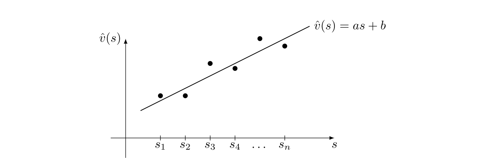
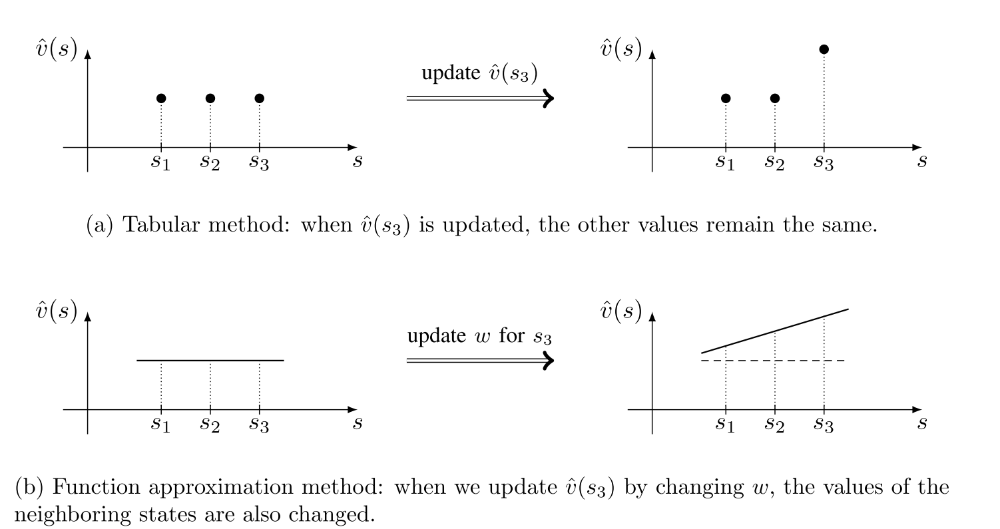

## 8.1 价值表示: 从表格到函数

接下来我们通过一个示例来展示表格化方法与函数近似方法之间的差异。

假设存在$n$个状态$\{s_i\}_{i=1}^n$，其状态值为$\{v_\pi(s_i)\}_{i=1}^n$，其中$\pi$为给定策略。令$\{\hat{v}(s_i)\}_{i=1}^n$表示对真实状态值的估计值。若采用表格法，这些估计值可维护于下表中。该表在内存中可存储为数组或向量，通过直接读写表中对应条目即可实现值的检索或更新。

| 状态         | $s_1$        | $s_2$        | $\cdots$ | $s_n$        |
|---------------|-----------|-----------|-----|-----------|
| 估计值 | $\hat{v}(s_1)$    | $\hat{v}(s_2)$    | $\cdots$ | $\hat{v}(s_n)$    |

接下来证明上表中的值可通过函数逼近。具体而言，将 $\{(s_i, \hat{v}(s_i))\}_{i=1}^n$表示为图$8.2$中的$n$个点，这些点可通过曲线进行拟合或逼近。最简单的曲线是直线，其表达式为：

$$\hat{v}(s,w)=as+b=\underbrace{[s,1]}_{\phi^T(s)}\underbrace{\begin{bmatrix}a\\b\end{bmatrix}}_{w}=\phi^T(s)w.\tag{8.1}$$

 

 > 图$8.2$：函数逼近方法示意图。$x$轴和$y$轴分别对应$s$与$\hat{v}(s)$。

此处，$\hat{v}(s, w)$是用于逼近$v_\pi(s)$的函数。该函数由状态$s$和参数向量$w \in \mathbb{R}^2$共同决定。$\hat{v}(s, w)$有时也写作$\hat{v}_w(s)$。其中$\phi(s) \in \mathbb{R}^2$称为状态$s$的特征向量。

表格化方法与函数近似方法之间的差异在于其数值检索与更新机制。

- **如何检索数值**：当数值以表格形式呈现时，若需检索特定值，可直接读取表中对应条目。然而，当数值由函数表示时，获取特定值的过程会稍显复杂。具体而言，我们需要将状态索引$s$输入函数并计算函数值(图$8.3$)。以式$(8.1)$为例，首先需要计算特征向量$\phi(s)$，再计算$\phi^T(s)w$。若函数为人工神经网络，则需从输入层到输出层执行前向传播计算。

     
     >图$8.3$：函数近似法求解$s$值过程的示意图。

    函数近似方法在存储效率方面更具优势，这源于其状态值的获取方式。具体而言，表格法需要存储$n$个状态值，而我们仅需存储一个低维参数向量$w$，因此存储效率可得到显著提升。然而这种优势并非没有代价：函数可能无法精确表征状态值。例如，图$8.2$中的数据点就无法用直线精确拟合，这正是该方法被称为"近似"的原因。从本质上看，当我们用低维向量表示高维数据集时，必然会造成部分信息损失。因此，函数近似方法通过牺牲精度来提升存储效率。

- **如何更新值**：当值以表格形式表示时，若需更新某个值，可直接重写表中对应条目。然而，当值以函数形式表示时，更新方式则完全不同。具体而言，我们必须通过间接更新权重$w$来实现值的变更。关于如何优化更新$w$以获取最佳状态值的方法，将在后文详细讨论。

    得益于状态值的更新方式，函数近似方法还具有另一优势：其泛化能力优于表格法。原因如下：使用表格法时，仅当某状态在回合中被访问时才能更新其对应值；而未访问状态的值则无法更新。然而，采用函数近似方法时，我们需要通过更新权重向量$w$来调整状态，$w$的更新会同时影响其他某些未被访问状态的值估计。因此，单个状态的经验样本能够泛化，从而辅助估计其他状态的值。

    上述分析如图$8.4$所示，其中包含三个状态$\{s_1, s_2, s_3\}$。

    假设我们有一个关于状态$s_3$的经验样本，并希望更新$\hat{v}(s_3)$。若采用表格化方法，如图$8.4(a)$所示，单独更新$\hat{v}(s_3)$不会影响$\hat{v}(s_1)$或$\hat{v}(s_2)$的值。但当使用函数近似方法时，如图$8.4(b)$所示，权重参数$w$的更新不仅会改变$\hat{v}(s_3)$，还会连带影响$\hat{v}(s_1)$和$\hat{v}(s_2)$的估值。因此，$s_3$的经验样本能够帮助更新其邻近状态的价值估计。

 
 > 图$8.4$：状态值更新方法示意图。

我们可以采用比直线具有更强近似能力的复杂函数。例如，考虑一个二阶多项式：

$$\hat{v}(s,w)=as^2+bs+c=\underbrace{[s^2,s,1]}_{\phi^T(s)}\underbrace{\begin{bmatrix}a\\b\\c\end{bmatrix}}_{w}=\phi^T(s)w.$$

我们可以采用更高阶的多项式曲线来拟合这些数据点。随着曲线阶数的增加，近似精度会相应提高，但参数向量的维度也会随之增大，从而需要更多的存储空间和计算资源。

注意到，$(8.1)$或$(8.2)$式中的$\hat{v}(s, w)$对于$w$是线性的(尽管对于$s$可能是非线性的)。这类方法称为**线性函数近似**，是最简单的函数近似方法。

为实现线性函数近似，需要选取合适的特征向量$\phi(s)$。例如，必须决定是采用一阶直线还是二阶曲线来拟合数据点。选择合适的特征向量并非易事，这需要任务相关的先验知识：对任务理解越深入，就能选择越好的特征向量。例如，若已知图$8.2$中的数据点大致分布在一条直线上，我们可以用直线拟合这些数据点。然而，这类先验知识在实际中通常未知。若没有任何先验知识，常用的解决方案是采用人工神经网络作为非线性函数近似器。

另一个关键问题是如何寻找最优参数向量。若已知$\{v_\pi(s_i)\}_{i=1}^n$，该问题可转化为最小二乘问题。通过优化以下目标函数即可获得最优参数：

$$\begin{aligned}J_1=\sum_{i=1}^n\left(\hat{v}(s_i,w)-v_\pi(s_i)\right)^2&=\sum_{i=1}^n\left(\phi^T(s_i)w-v_\pi(s_i)\right)^2\\&\left.\left.=\left\|\left[\begin{array}{c}\phi^T(s_1)\\\vdots\\\phi^T(s_n)\end{array}\right.\right.\right]w-\begin{bmatrix}v_\pi(s_1)\\\vdots\\v_\pi(s_n)\end{bmatrix}\right\|^2\doteq\|\Phi w-v_\pi\|^2,\end{aligned}$$

在这里

$$\Phi\doteq\begin{bmatrix}\phi^T(s_1)\\\vdots\\\phi^T(s_n)\end{bmatrix}\in\mathbb{R}^{n\times2},\quad v_\pi\doteq\begin{bmatrix}v_\pi(s_1)\\\vdots\\v_\pi(s_n)\end{bmatrix}\in\mathbb{R}^n.$$

可以验证，该最小二乘问题的最优解为

$$w^*=(\Phi^T\Phi)^{-1}\Phi v_\pi.$$

关于最小二乘问题的更多细节可参阅文献[47,第3.3节]和[48,第5.14节]。

本节展示的曲线拟合示例阐释了价值函数近似的基本思想，该思想将在下一节进行正式定义。