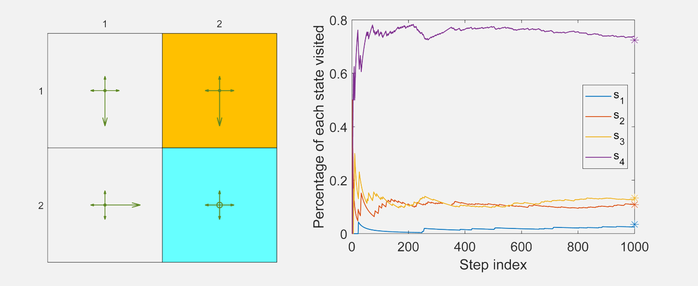

## 基于值函数的时序差分算法: 状态值估计

本节将阐述如何将函数近似方法整合至时序差分(TD)学习框架中，用于估计给定策略的状态值。该算法将在$8.3$节进一步扩展至行动值与最优策略的学习。

本节包含多个子章节及大量连贯内容。建议在深入细节前先整体回顾内容。

- 函数近似方法被表述为一个优化问题。该问题的目标函数在第$8.2.1$节中给出。用于优化该目标函数的TD学习算法将在第$8.2.2$节中介绍。

- 为应用TD学习算法，我们需要选择合适的特征向量。$8.2.3$节将讨论该问题。

- $8.2.4$节通过示例演示了TD算法及不同特征向量的影响。

- 关于TD算法的理论分析详见第$8.2.5$节。该小节数学推导较为密集，读者可根据兴趣选择性阅读。

### 8.2.1 目标函数

设$v_\pi(s)$与$\hat{v}(s, w)$分别表示状态$s \in S$的真实状态值和近似状态值。待求解的问题是找到最优参数$w$，使得对于所有状态$s$，$\hat{v}(s, w)$能最佳近似$v_\pi(s)$。具体而言，目标函数为

$$J(w)=\mathbb{E}[(v_\pi(S)-\hat{v}(S,w))^2],\tag{8.3}$$

其中期望值是关于随机变量$S \in \mathcal{S}$计算的。虽然$S$是一个随机变量，但其概率分布是什么？这个问题对于理解该目标函数至关重要。定义$S$的概率分布有以下几种方式。

- **第一种方法是采用均匀分布**。即通过将每个状态的概率设为$1/n$，将所有状态视为同等重要。此时，$(8.3)$中的目标函数变为

    $$J(w)=\frac{1}{n}\sum_{s\in\mathcal{S}}(v_\pi(s)-\hat{v}(s,w))^2,\tag{8.4}$$
    
    这是所有状态近似误差的平均值。然而，这种方法没有考虑给定策略下马尔可夫过程的真实动态特性。由于某些状态可能很少被策略访问到，将所有状态视为同等重要并不合理。

- **第二种方法(本章重点)是利用稳态分布(stationary distribution)**。稳态分布描述了马尔可夫决策过程的长期行为(long-run behavior)；具体而言，当智能体执行给定策略足够长时间后，其处于任意状态的概率均可由该稳态分布表征。感兴趣的读者可参阅Box$8.1$获取细节。

    设$\{d_\pi(s)\}_{s\in\mathcal{S}}$表示策略$\pi$下马尔可夫过程的稳态分布。即智能体在长时间运行后访问状态$s$的概率为$d_\pi(s)$。根据定义，满足$\sum_{s\in\mathcal{S}}d_\pi(s)=1$。因此，$(8.3)$中的目标函数可改写为
    
    $$J(w)=\sum_{s\in\mathcal{S}}d_\pi(s)(v_\pi(s)-\hat{v}(s,w))^2,$$
    
    这是一个对近似误差进行加权平均的指标。那些被访问概率较高的状态会被赋予更大的权重。

!!! note 
    long-run behavior就是从某一个状态出发，然后我按照策略采取行动，然后不断地去和环境进行交互，然后一直采取这个策略，采取非常多次之后，我就达到了一种平稳的状态，在那个平稳的状态下就得到在每一个状态智能体出现它的概率是多少。

 

 > 图$8.5$：$\varepsilon=0.5$的$\varepsilon$-贪心策略长期行为。右图中星号表示向量$d^\pi$各分量的理论值。

值得注意的是，$d_\pi(s)$的值难以直接获取，因为这需要已知状态转移概率矩阵$P^\pi$（参见方框$8.1$）。幸运的是，如后续小节所示，我们无需计算$d_\pi(s)$的具体值即可最小化该目标函数。此外，在引入式$(8.4)$和$(8.5)$时，我们假设状态数量是有限的。当状态空间连续时，可将求和运算替换为积分运算。

### 8.2.2 优化算法

为最小化式$(8.3)$中的目标函数$J(w)$，可采用梯度下降算法：

$$w_{k+1}=w_k-\alpha_k\nabla_wJ(w_k),$$

在这里

$$\begin{aligned}\nabla_wJ(w_k)&=\nabla_w\mathbb{E}[(v_\pi(S)-\hat{v}(S,w_k))^2]\\&=\mathbb{E}[\nabla_w(v_\pi(S)-\hat{v}(S,w_k))^2]\\&=2\mathbb{E}[(v_\pi(S)-\hat{v}(S,w_k))(-\nabla_w\hat{v}(S,w_k))]\\&=-2\mathbb{E}[(v_\pi(S)-\hat{v}(S,w_k))\nabla_w\hat{v}(S,w_k)].\end{aligned}$$

因此，梯度下降算法是

$$w_{k+1}=w_k+2\alpha_k\mathbb{E}[(v_\pi(S)-\hat{v}(S,w_k))\nabla_w\hat{v}(S,w_k)],\tag{8.11}$$

其中系数$2$可以不失一般性地合并到$\alpha_k$中。式$(8.11)$的算法需要计算期望值。根据随机梯度下降法的思想，我们可以用随机梯度替代真实梯度。因此，$(8.11)$式可改写为

$$w_{t+1}=w_t+\alpha_t\left(v_\pi(s_t)-\hat{v}(s_t,w_t)\right)\nabla_w\hat{v}(s_t,w_t),\tag{8.12}$$

其中$s_t$是$S$在时刻$t$的采样值。

值得注意的是，$(8.12)$式不可直接实现，因为它需要真实的状态值$v_\pi$——该值未知且必须通过估计获得。我们可以用近似值替代$v_\pi(s_t)$使算法可执行，具体可通过以下两种方法实现。

- **蒙特卡洛方法**：假设我们有一个回合$(s_0,r_1,s_1,r_2,\ldots)$。令$g_t$表示从状态$s_t$开始的折现回报，则$g_t$可作为$v_\pi(s_t)$的估计值。此时式$(8.12)$中的算法可改写为

    $$w_{t+1}=w_t+\alpha_t\left(g_t-\hat{v}(s_t,w_t)\right)\nabla_w\hat{v}(s_t,w_t).$$
    
    这是基于函数近似的蒙特卡洛学习算法。

- **时序差分法**：根据TD学习的思想，$r_{t+1}+\gamma\hat{v}(s_{t+1},w_t)$可作为$v_\pi(s_t)$的估计值。此时$(8.12)$式中的算法变为

    $$w_{t+1}=w_t+\alpha_t\left[r_{t+1}+\gamma\hat{v}(s_{t+1},w_t)-\hat{v}(s_t,w_t)\right]\nabla_w\hat{v}(s_t,w_t).\tag{8.13}$$
    
    这是基于函数近似的TD学习算法。该算法总结在算法$8.1$中。

 
 > 算法$8.1$: 基于状态值函数近似的TD学习。

理解式$(8.13)$中的TD算法对于研究本章其他算法至关重要。值得注意的是，$(8.13)$仅能学习给定策略的状态值。在$8.3.1$和$8.3.2$节中，我们将把它扩展为能够学习行动值的算法。

### 8.2.3 函数近似器的选择

为应用$(8.13)$中的TD算法，需选择合适的$\hat{v}(s, w)$。具体有两种实现方式：其一，采用人工神经网络作为非线性函数近似器，其中网络输入为状态$s$，输出为$\hat{v}(s, w)$，网络参数为$w$；其二，直接采用**线性**函数：

$$\hat{v}(s,w)=\phi^T(s)w,$$

其中$\phi(s) \in \mathbb{R}^m$表示状态$s$的特征向量。$\phi(s)$与$w$的维度均为$m$，该值通常远小于状态空间的总数。在线性情况下，梯度表达式为

$$\nabla_w\hat{v}(s,w)=\phi(s),$$

将其代入式$(8.13)$可得

$$w_{t+1}=w_t+\alpha_t\left[r_{t+1}+\gamma\phi^T(s_{t+1})w_t-\phi^T(s_t)w_t\right]\phi(s_t).\tag{8.14}$$

这是采用线性函数近化的TD学习算法，简称为TD-Linear。

线性情况在理论上比非线性情况更易理解，但其近似能力有限。对于复杂任务，选择合适的特征向量也非易事。相比之下，人工神经网络作为黑箱非线性近似器，能够更好地近似目标值，且更易于使用。

然而，研究线性情形仍具重要意义。深入理解线性情形有助于读者更好地掌握函数近似方法的核心思想。此外，本书讨论的简单网格世界任务中，线性情形已足以解决问题。更重要的是，从表格化方法可视为特殊线性情形这一视角来看，线性方法仍具有强大的能力。关于表格化方式为什么是一种特殊的TD-Linear可参阅Box 8.2。

### 8.2.4 例子

接下来我们通过示例展示如何利用$(8.14)$中的TD-Linear算法估计给定策略的状态值，同时说明特征向量的选取方法。

 
 > 图$8.6$:$(a)$待评估策略。$(b)$真实状态值以表格形式呈现。$(c)$真实状态值以三维曲面形式呈现。

网格世界示例如图$8.6$所示。给定策略在每个状态下以$0.2$的概率采取任意动作。我们的目标是估计该策略下的状态值。该系统共包含$25$个状态值。真实状态值如图$8.6(b)$所示，其三维曲面可视化结果展示在图$8.6(c)$中。

!!! note
    总共有25个状态值，如果用表格的方式，那么需要存储25个状态值。

接下来我们证明，可以用少于$25$个参数来近似这些状态值。仿真设置如下：通过给定策略生成$500$个回合，每个回合包含$500$个步长，每个回合出发的状态-行动对是随机选择的，并且遵循均匀分布。此外，在每次仿真试验中，参数向量$w$被随机初始化，其每个元素均从均值为$0$、标准差为$1$的标准正态分布中抽取。我们设定$r_{\text{forbidden}} = r_{\text{boundary}} = -1$，$r_{\text{target}} =1$，以及$\gamma =0.9$。

为实现TD-Linear算法，首先需要选择特征向量$\phi(s)$。具体实现方式如下所示。

- 第一种特征向量基于多项式构建。在网格世界示例中，状态$s$对应二维坐标位置，其中$x$和$y$分别表示$s$的列索引与行索引。为避免数值问题，我们将$x$和$y$归一化至区间$[-1, +1]$内。在不引起歧义的前提下，归一化后的值仍用$x$和$y$表示。此时，最简单的特征向量可表示为

    $\phi(s)=\begin{bmatrix}x\\y\end{bmatrix}\in\mathbb{R}^2.$

    在此情况下，我们有

    $$\hat{v}(s,w)=\phi^T(s)w=[x,y]\begin{bmatrix}w_1\\w_2\end{bmatrix}=w_1x+w_2y.$$
    
    当给定$w$时，$\hat{v}(s, w) = w_1x + w_2y$表示一个通过原点的二维平面。由于状态值曲面可能不经过原点，我们需要为该二维平面引入偏置项以更好地逼近状态值。为此，我们考虑以下三维特征向量：
    
    $$\phi(s)=\begin{bmatrix}1\\x\\y\end{bmatrix}\in\mathbb{R}^3.\tag{8.15}$$
    
    在此情况下，近似状态值为
    
    $$\hat{v}(s,w)=\phi^T(s)w=[1,x,y]\begin{bmatrix}w_1\\w_2\\w_3\end{bmatrix}=w_1+w_2x+w_3y.$$
    
    当给定$w$时，$\hat{v}(s, w)$对应一个可能不经过原点的平面。值得注意的是$\varphi(s)$也可以定义为$\varphi(s) = [x, y,1]^T$，其中元素的排列顺序无关紧要。

    采用式$(8.15)$中特征向量所得的估计结果如图$8.7(a)$。可以看出，估计的状态值形成一个二维平面。尽管随着使用更多训练回合估计误差会收敛，但由于二维平面的近似能力有限，该误差无法降至零。
    
    为提升近似能力，可通过增加特征向量的维度实现。为此，考虑
    
    $$\phi(s)=[1,x,y,x^2,y^2,xy]^T\in\mathbb{R}^6.\tag{8.16}$$
    
    在这种情况下，$\hat{v}(s, w) = \varphi^T(s)w = w_1 + w_2x + w_3y + w_4x^2 + w_5y^2 + w_6xy$，对应一个二次三维曲面。我们可以进一步增加特征向量的维度：
    
    $$\phi(s)=[1,x,y,x^2,y^2,xy,x^3,y^3,x^2y,xy^2]^T\in\mathbb{R}^{10}.\tag{8.17}$$
    
    使用式$(8.16)$和$(8.17)$中特征向量得到的估计结果如图$8.7(b)-(c)$所示。可以看出，特征向量越长，状态值的近似精度越高。但在所有三种情况下，估计误差均无法收敛至零，这是因为这些线性近似器仍存在表达能力局限。

 
 > 图$8.7$：采用多项式特征$(8.15)$,$(8.16)$和$(8.17)$得到的TD-Linear估计结果。

- 除了多项式特征向量外，还存在多种其他类型的特征表示方法，例如傅里叶基(Fourier basis)和片编码(Tile coding)[3,第9章]。首先，需确定变量$x$与$y$的
各状态量被归一化至区间[0,1]。所得特征向量为

    $$\left.\phi(s)=\left[\begin{array}{c}\vdots\\\cos\left(\pi(c_1x+c_2y)\right)\\\vdots\end{array}\right.\right]\in\mathbb{R}^{(q+1)^2},\tag{8.18}$$
    
    其中$\pi$表示圆周率，其值为$3.1415...$，而非策略。此处$c_1$或$c_2$可设置为集合$\{0,1, ..., q\}$中的任意整数，其中$q$为用户指定整数。因此，二元组$(c_1, c_2)$共有$(q +1)^2$种可能的取值组合，故特征映射$\phi(s)$的维度为$(q +1)^2$。例如当$q=1$时，特征向量可表示为
    
    $$\left.\phi(s)=\left[\begin{array}{c}\cos\left(\pi(0x+0y)\right)\\\cos\left(\pi(0x+1y)\right)\\\cos\left(\pi(1x+0y)\right)\\\cos\left(\pi(1x+1y)\right)\end{array}\right.\right]=\begin{bmatrix}1\\\cos(\pi y)\\\cos(\pi x)\\\cos(\pi(x+y))\end{bmatrix}\in\mathbb{R}^4.$$
    
    采用$q =1,2,3$的傅里叶特征进行估计的结果如图$8.8$所示。三种情况下特征向量的维度分别为$4,9,16$。可以看出，特征向量维度越高，状态值的近似精度越高。

 
 > 图$8.8$：采用式$(8.18)$中傅里叶特征得到的TD-Linear估计结果。

### 8.2.5 理论分析

至此，我们已经完整阐述了函数近似下的TD学习理论框架。该框架的起点是公式$(8.3)$中的目标函数。为优化这一目标，我们在$(8.12)$中引入了随机算法。随后，将该算法中未知的真实值函数替换为近似值，从而得到$(8.13)$中的TD算法。虽然这个叙述有助于理解值函数近似的基本思想，但从数学角度并不严谨。例如，$(8.13)$中的算法实际上并未最小化$(8.3)$中的目标函数。

接下来，我们对式$(8.13)$中的TD算法进行理论分析，以揭示该算法高效运作的机理及其解决的数学问题。由于非线性近似器难以分析，本节仅讨论线性情形。鉴于本部分数学推导较为密集，建议读者根据兴趣选择性阅读。

#### 收敛性分析

为研究式 (8.13)的收敛性，我们首先考察以下确定性算法:

$$w_{t+1}=w_t+\alpha_t\mathbb{E}\left[\left(r_{t+1}+\gamma\phi^T(s_{t+1})w_t-\phi^T(s_t)w_t\right)\phi(s_t)\right],\tag{8.19}$$

其中期望值是关于随机变量$s_t$,$s_{t+1}$.$r_{t+1}$计算的。假设$s_t$的分布为平稳分布$d^\pi$。式$(8.19)$中的算法是确定性的，因为在计算期望后，随机变量$s_t$,$s_{t+1}$.$r_{t+1}$均被消除。

我们为何考虑这一确定性算法？首先，该确定性算法的收敛性分析更为简便(尽管并非平凡)；其次且更重要的是，其收敛性可推导出随机TD算法$(8.13)$的收敛性。这是因为$(8.13)$可视为$(8.19)$的随机梯度下降$(SGD)$实现。因此，我们仅需研究确定性算法的收敛特性。

虽然式$(8.19)$的表达式初看可能较为复杂，但可大幅简化。为此，定义

$$\Phi=\begin{bmatrix}\vdots\\\phi^T(s)\\\vdots\end{bmatrix}\in\mathbb{R}^{n\times m},\quad D=\begin{bmatrix}\ddots\\&d_\pi(s)\\&&\ddots\end{bmatrix}\in\mathbb{R}^{n\times n},\tag{8.20}$$

其中$\Phi$为包含所有特征向量的矩阵，$D$是以平稳分布为对角元素的对角矩阵。这两个矩阵将频繁使用。

!!! info 
    **引理8.1**. 式$(8.19)$中的期望可改写为

    $$\mathrm{E}\left[\left(r_{t+1}+\gamma\phi^{T}(s_{t+1})w_{t}-\phi^{T}(s_{t})w_{t}\right)\phi(s_{t})\right]=b-Aw_{t},$$

    在这里

    $$\begin{aligned}&A\doteq\Phi^{T}D(I-\gamma P_{\pi})\Phi\in\mathbb{R}^{m\times m},\\&b\doteq\Phi^{T}Dr_{\pi}\in\mathbb{R}^{m}.\end{aligned}\tag{8.21}$$

    此处，$P_\pi$和 $r_\pi$是贝尔曼方程$v_\pi = r_\pi + \gamma P_\pi v_\pi$中的两项，$I$为相应维度的单位矩阵。

证明过程见Box 8.3。根据引理$8.1$中的表达式，确定性算法$(8.19)$可改写为

$$w_{t+1}=w_t+\alpha_t(b-Aw_t),\tag{8.22}$$

这是一个简单的确定性过程，其收敛性分析如下。

首先，$w_t$的收敛值是多少？假设当$t\rightarrow \infty$时，$w_t$收敛至常数值$w^∗$，则由式$(8.22)$可得$w^∗ = w^∗ + \alpha_\infty(b − Aw^*)$，这意味着$b − Aw^* =0$，因此

$$w^*=A^{-1}b.$$

关于该收敛值的几点说明如下。

- 矩阵$A$是否可逆？答案是肯定的。事实上，$A$不仅可逆，还是正定矩阵。也就是说，对于任意适当维度的非零向量 $\mathbf{x}$，均有$\mathbf{x}^T A \mathbf{x} >0$。证明过程见Box 8.4。

- 如何解释$w^* = A^{-1}b$的含义？它实际上是**最小化投影贝尔曼误差**的最优解。具体细节将在第8.2.5节中阐述。

- 表格化方法是一种特殊情况。一个有趣的结果是，当权重向量$\mathbf{w}$的维度等于状态空间大小$n = |\mathcal{S}|$且特征函数$\phi(s) = [0, \ldots,1, \ldots,0]^T$(其中对应状态$s$的元素为$1$)时，我们得到

$$w^*=A^{-1}b=v_\pi.\tag{8.23}$$

 该方程表明待学习的参数向量实际上是真实状态值。这一结论与表格型TD算法是TD-Linear算法特例的事实相符(如Box 8.2所述)。式$(8.23)$的证明如下：此时可验证$\Phi = I$，因此$A = \Phi^\text{T}D(I - \gamma P^\pi)\Phi = D(I - \gamma P^\pi)$且$b = \Phi^\text{T}Dr^\pi = Dr^\pi$。故而有$w^* = A^{-1}b = (I - \gamma P^\pi)^{-1}D^{-1}Dr^\pi = (I - \gamma P^\pi)^{-1}r^\pi = v^\pi$。

其次，我们证明当$t \to \infty$时，$(8.22)$式中的$w_t$收敛于$w^* = A^{-1}b$。由于$(8.22)$式是一个简单的确定性过程，可通过多种方法证明。下面给出两种证明方式。

- 证明方法1: 定义收敛误差为$\delta_t = w_t - w^*$。只需证明$\delta_t$收敛于零即可。为此，将$w_t = \delta_t + w^*$

    $$\delta_{t+1}=\delta_t-\alpha_tA\delta_t=(I-\alpha_tA)\delta_t.$$

    由此可得

    $$\delta_{t+1}=(I-\alpha_tA)\cdots(I-\alpha_0A)\delta_0.$$

    考虑所有时刻 $t$下 $\alpha_t = \alpha$的简单情形，此时可得

    $$\|\delta_{t+1}\|_2\leq\|I-\alpha A\|_2^{t+1}\|\delta_0\|_2.$$

    当$\alpha >0$充分小时，有$\|I - \alpha A\|_2 <1$，因此当$t \to \infty$时$\delta_t \to0$。该不等式成立的原因是$A$正定，故对任意$x$均有$x^T(I - \alpha A)x <1$。

- 证明方法2: 考虑函数$g(w) = b - Aw$。由于$w^*$是方程$g(w) =0$的根，该问题本质上是一个求根问题。式$(8.22)$中的算法实际上是一种RM算法。虽然原始 RM算法是为随机过程设计的，但它同样适用于确定性情形。RM算法的收敛性可以解释迭代式$w_{t+1} = w_t + \alpha_t(b - Aw_t)$的收敛行为：当满足$\sum_t \alpha_t = \infty$且$\sum_t \alpha_t^2 < \infty$时，$w_t$将收敛至$w^*$。

#### TD学习最小化投影贝尔曼误差

虽然我们已经证明TD-Linear算法收敛于$w^* = A^{-1}b$，但接下来我们将证明$w^*$是最小化投影贝尔曼误差的最优解。为此，我们首先回顾三个目标函数。

- 第一个目标函数是

    $$J_E(w)=\mathbb{E}[(v_\pi(S)-\hat{v}(S,w))^2],$$

    该定义已在(8.3)节中给出。根据期望的定义，$J_E(\mathbf{w})$可重新表示为矩阵-向量形式：

    $$J_E(w)=\|\hat{v}(w)-v_\pi\|_D^2,$$

    其中 $v_\pi$为真实状态值向量，$\hat{v}(w)$为其近似值。此处 $\|\cdot\|_D$为加权范数：$\|x\|_D^2 = x^\top D x = \|D^{1/2}x\|_2^2$，其中 $D$由式 (8.20)给出。

    这是我们在讨论函数逼近时能设想的最简单目标函数。然而，它依赖于真实状态(该状态未知)。为获得可实现的算法，我们必须考虑其他目标函数，例如贝尔曼误差和投影贝尔曼误差[50–54]。

- 第二个目标函数是贝尔曼误差(Bellman error)。特别地，由于$v_\pi$满足贝尔曼方程$v_\pi = r_\pi + \gamma P_\pi v_\pi$，可以预期估计值$\hat{v}(w)$也应尽可能满足该方程。因此，贝尔曼误差为

    $$J_{BE}(w)=\|\hat{v}(w)-(r_\pi+\gamma P_\pi\hat{v}(w))\|_D^2\doteq\|\hat{v}(w)-T_\pi(\hat{v}(w))\|_D^2.\tag{8.30}$$

    此处，$T_\pi(\cdot)$为贝尔曼算子。特别地，对于任意向量 $\mathbf{x} \in \mathbb{R}^n$，贝尔曼算子定义为

    $$T_\pi(x)\doteq r_\pi+\gamma P_\pi x.$$

    最小化贝尔曼误差是一个标准的最小二乘问题。此处省略求解过程的细节。

<<<<<<< HEAD
- 第三，值得注意的是，$(8.30)$中的 $J_{BE}(w)$可能无法被最小化至零，这是由于近似器的有限近似能力所致。相比之下，能够被最小化至零的目标函数是投影贝尔曼误差(projected bellman error)：
=======
- 第三，值得注意的是，$(8.30)$中的 $J_{BE}(w)$可能无法被最小化至零，这是由于近似器的有限近似能力所致。相比之下，能够被最小化至零的目标函数是投影贝尔曼误差：
>>>>>>> 50b98123eef511e961e9c05b37b46f2a667dafb0

    $$J_{PBE}(w)=\|\hat{v}(w)-MT_\pi(\hat{v}(w))\|_D^2,$$

    其中$M \in \mathbb{R}^{n \times n}$为正交投影矩阵，其几何意义是将任意向量投影至所有近似解构成的空间。

事实上，$(8.13)$中的TD学习算法旨在最小化投影贝尔曼误差$J_{PBE}$而非$J_E$或$J_{BE}$。原因如下：为简化分析，考虑线性情况$\hat{v}(w) = \Phi w$，其中$\Phi$由$(8.20)$式定义。$\Phi$的值域空间是所有可能的线性近似构成的集合。此时，

$$M=\Phi(\Phi^TD\Phi)^{-1}\Phi^TD\in\mathbb{R}^{n\times n}$$

是投影矩阵，可将任意向量几何投影到值域空间$\Phi$上。由于$\hat{v}(w)$位于 $\Phi$的值域空间内，总能找到使$J_{PBE}(w)$最小化至零的$w$值。可以证明，使$J_{PBE}(w)$最小化的解为$w^* = A^{-1}b$。即

$$w^*=A^{-1}b=\arg\min_wJ_{PBE}(w),$$

证明在Box 8.5中给出

由于TD算法的目标是最小化$J_{PBE}$而非$J_E$，自然会产生一个问题：估计值$\hat{v}(w)$与真实状态值$v_\pi$的接近程度如何？在线性情况下，最小化投影贝尔曼误差的估计值为$\hat{v}(w^*) = \Phi w^*$。该估计值与真实状态值$v_\pi$的偏差满足

$$\|\hat{v}(w^*)-v_\pi\|_D=\|\Phi w^*-v_\pi\|_D\leq\frac{1}{1-\gamma}\min_w\|\hat{v}(w)-v_\pi\|_D=\frac{1}{1-\gamma}\min_w\sqrt{J_E(w)}.\tag{8.32}$$

该不等式的证明见Box 8.6。不等式$(8.32)$表明，$\Phi w^*$与$v_\pi$之间的差异上界由$J_E(w)$的最小值决定。然而该界限较为宽松，尤其当$\gamma$接近$1$时。因此该结论主要具有理论价值。

#### 最小二乘TD

接下来我们介绍一种称为最小二乘时序差分(LSTD)的算法[57]。与线性时序差分(TD-Linear)算法类似，LSTD的目标是最小化投影贝尔曼误差。但该算法相较于TD-Linear具有若干优势。

回顾最小化投影贝尔曼误差的最优参数为$w^* = A^{-1}b$，其中$A = \Phi^TD(I - \gamma P^\pi)\Phi$且$b = \Phi^TDr^\pi$。实际上，由式$(8.27)$可知，$A$和$b$亦可表示为

$$\begin{aligned}&A=\mathbb{E}\left[\phi(s_t)\left(\phi(s_t)-\gamma\phi(s_{t+1})\right)^T\right],\\&b=\mathbb{E}\left[r_{t+1}\phi(s_{t})\right].\end{aligned}$$

上述两个方程表明，$A$和 $b$分别是 $s_t$、$s_{t+1}$、$r_{t+1}$的期望值。LSTD算法的核心思想很简单：若能通过随机采样直接获得$A$和$b$的估计量$\hat{A}$与$\hat{b}$，则最优参数可直接估计为$w^* \approx \hat{A}^{-1}\hat{b}$。

特别地，假设$(s_0, r_1, s_1, \ldots, s_t, r_{t+1}, s_{t+1}, \ldots)$是通过遵循给定策略$\pi$所获得的轨迹。设$\hat{A}_t$和 $\hat{b}_t$分别为时刻$t$时$A$和$b$的估计值，其计算方式为样本均值：

$$\begin{aligned}&\mathrm{A}=\sum_{k=0}^{t-1}\phi(s_k)\left(\phi(s_k)-\gamma\phi(s_{k+1})\right)^T,\\&\hat{b}_{t}=\sum_{k=0}^{t-1}r_{k+1}\phi(s_{k}).\end{aligned}\tag{8.34}$$

则估计参数为

$$w_t=\hat{A}_t^{-1}\hat{b}_t.$$

读者可能会疑惑$(8.34)$式右侧是否遗漏了$1/t$的系数。实际上，该系数被有意省略以简化表达式，因为省略后$w_t$的值保持不变。由于$\hat{A}_t$在小样本情况下可能不可逆，通常需要对其施加微小偏置$\sigma I$(其中$I$为单位矩阵，$\sigma$为微小正数)。

LSTD算法的优势在于，相较于TD方法，它能更高效地利用经验样本且收敛速度更快。这是因为该算法是专门基于最优解表达式知识设计的——对问题的理解越深入，算法设计就越精良。

LSTD算法的缺点如下。首先，它仅能估计状态值；相比之下，如后文所示，TD算法可扩展至行动值估计。此外，TD算法允许使用非线性近似器，而LSTD则不具备该特性——这是因为该算法是专门基于$w^*$的表达式设计的。其次，LSTD的计算成本高于TD算法：LSTD在每次更新步骤中需处理$m \times m$矩阵，而TD仅更新$m$维向量。更重要的是，LSTD每一步都需要计算$\hat{A}_t$的逆矩阵，其计算复杂度为$O(m^3)$。解决该问题的通用方法是直接更新$\hat{A}_t$的逆矩阵而非$\hat{A}_t$本身，具体而言，$\hat{A}_{t+1}$可通过如下递归方式计算：

$$\begin{aligned}\hat{A}_{t+1}&=\sum_{k=0}^t\phi(s_k)\left(\phi(s_k)-\gamma\phi(s_{k+1})\right)^T\\&=\sum_{k=0}^{t-1}\phi(s_{k})\left(\phi(s_{k})-\gamma\phi(s_{k+1})\right)^{T}+\phi(s_{t})\left(\phi(s_{t})-\gamma\phi(s_{t+1})\right)^{T}\\&=\hat{A}_t+\phi(s_t)\left(\phi(s_t)-\gamma\phi(s_{t+1})\right)^T.\end{aligned}$$

上述表达式将 $\hat{A}_{t+1}$分解为两个矩阵之和，其逆矩阵可按文献[58]方法计算为

$$\begin{aligned}\hat{A}_{t+1}^{-1}&=\left(\hat{A}_{t}+\phi(s_{t})\left(\phi(s_{t})-\gamma\phi(s_{t+1})\right)^{T}\right)^{-1}\\&=\hat{A}_{t}^{-1}+\frac{\hat{A}_{t}^{-1}\phi(s_{t})\left(\phi(s_{t})-\gamma\phi(s_{t+1})\right)^{T}\hat{A}_{t}^{-1}}{1+\left(\phi(s_{t})-\gamma\phi(s_{t+1})\right)^{T}\hat{A}_{t}^{-1}\phi(s_{t})}.\end{aligned}$$

因此，我们可以直接存储并更新$\hat{A}^{-1}_t$以避免计算矩阵逆。该递归算法无需设置步长，但需要给定$\hat{A}^{-1}_0$的初始值。此类递归算法的初始值通常选为$\hat{A}^{-1}_0 = \sigma I$，其中$\sigma$为正数。关于递归最小二乘法的详细教程可参阅文献[59]。