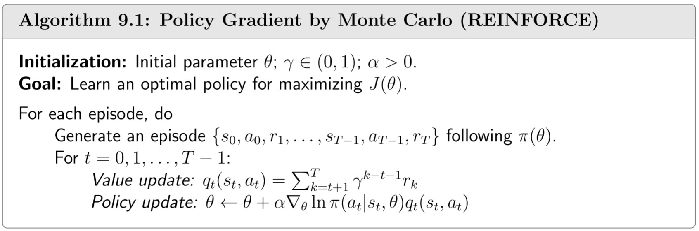

## 9.4 蒙特卡洛策略梯度

根据定理$9.1$给出的梯度，我们接下来展示如何利用基于梯度的方法优化指标，从而获得最优策略。

用于最大化$J(\theta)$的梯度上升算法为

$$\begin{align}\theta_{t+1} &= \theta_t + \alpha \nabla_\theta J(\theta_t) \\&= \theta_t + \alpha \mathbb{E}\!\left[ \nabla_\theta \ln \pi(A|S, \theta_t) q_\pi(S, A) \right]\end{align},\tag{9.31}$$

其中$\alpha >0$为恒定学习率。由于式$(9.31)$中的真实梯度未知，可用随机梯度替代真实梯度，得到如下算法：

$$\theta_{t+1} = \theta_t + \alpha \nabla_\theta \ln \pi(a_t \mid s_t, \theta_t) q_\pi(s_t, a_t),\tag{9.32}$$

其中$q_t(s_t, a_t)$是$q_\pi(s_t, a_t)$的近似估计。若$q_t(s_t, a_t)$通过蒙特卡洛估计获得，则该算法称为**REINFORCE**[68]或**蒙特卡洛策略梯度算法**，这是最早且最简单的策略梯度算法之一。

式$(9.32)$中的算法具有重要意义，因为通过扩展它可以衍生出许多其他策略梯度算法。接下来我们更深入地分析式$(9.32)$的数学内涵。由于$\nabla_\theta \ln \pi(a_t|s_t, \theta_t) = \frac{\nabla_\theta \pi(a_t|s_t,\theta_t)}{\pi(a_t|s_t,\theta_t)}$，可将式$(9.32)$改写为

$$\theta_{t+1} = \theta_t + \alpha (\underbrace{\frac{q_\pi(s_t, a_t)}{\pi(a_t \mid s_t, \theta_t)}}_{\beta_t}) \nabla_\theta \pi(a_t \mid s_t, \theta_t),$$

可进一步简洁表示为

$$\theta_{t+1} = \theta_t + \alpha \beta_t \nabla_\theta \pi(a_t \mid s_t, \theta_t),\tag{9.33}$$

从该方程可以得出两个重要解释。

- 首先，由于式 (9.33)是一个简单的梯度上升算法，因此可以得到以下结论。

    - 若$\beta_t \geq0$，选择$(s_t, a_t)$的概率将增强，即 
  
        $$\pi(a_t|s_t, \theta_{t+1}) \geq \pi(a_t|s_t, \theta_t)$$
        
        $\beta_t$越大，增强效果越显著。

    - 若$\beta_t <0$，选择$(s_t, a_t)$的概率将降低，即 
   
        $$\pi(a_t|s_t, \theta_{t+1}) < \pi(a_t|s_t, \theta_t)$$
        
    上述结论可通过以下方式证明：当$\theta_{t+1} - \theta_t$足够小时，根据泰勒展开可得

    $$\begin{align}\pi(a_t \mid s_t, \theta_{t+1}) &\approx \pi(a_t \mid s_t, \theta_t) + \left( \nabla_\theta \pi(a_t \mid s_t, \theta_t) \right)^T (\theta_{t+1} - \theta_t) \\&= \pi(a_t \mid s_t, \theta_t) + \alpha \beta_t \big( \nabla_\theta \pi(a_t \mid s_t, \theta_t) \big)^T \big( \nabla_\theta \pi(a_t \mid s_t, \theta_t) \big) \quad \text{(substituting (9.33))} \\&= \pi(a_t \mid s_t, \theta_t) + \alpha \beta_t \, \| \nabla_\theta \pi(a_t \mid s_t, \theta_t) \|_2^2.\end{align}$$

    显然，当$\beta_t \geq0$时，$\pi(a_t|s_t, \theta_{t+1}) \geq \pi(a_t|s_t, \theta_t)$；而当$\beta_t <0$时，$\pi(a_t|s_t, \theta_{t+1}) < \pi(a_t|s_t, \theta_t)$。

- 其次，由于$\beta_t$的存在，该算法在一定程度上能够在探索与利用之间取得平衡。
    
    $$\beta_t = \frac{q_t(s_t, a_t)}{\pi(a_t \mid s_t, \theta_t)}$$

    一方面，$\beta_t$与$q_t(s_t, a_t)$成正比。因此，若状态-行动对$(s_t, a_t)$的行动值较大，则策略$\pi(a_t|s_t, \theta_t)$会增强，从而提高选择行动$a_t$的概率。此时算法倾向于**利用**高价值动作。另一方面，当$q_t(s_t, a_t) >0$时，$\beta_t$与$\pi(a_t|s_t, \theta_t)$成反比。因此，若选择行动$a_t$的初始概率较小，策略$\pi(a_t|s_t, \theta_t)$会被增强以提升其选择概率。此时算法倾向于**探索**低概率动作。

!!! note    
    如果刚开始$a_t$选择概率比较小，那么我会在下个时刻给他更大的概率去选择它.

此外，由于$(9.32)$采用样本来近似$(9.31)$中的真实梯度，因此理解如何获取这些样本至关重要。

- 如何采样$S$?真实梯度$\mathbb{E}[\nabla_\theta \ln \pi(A|S, \theta_t)q_\pi(S, A)]$中的$S$应服从分布$\eta$，该分布可以是稳态分布$d_\pi$或$(9.19)$式中的折扣总概率分布$\rho_\pi$。$d_\pi$和$\rho_\pi$均表示策略$\pi$下的长期行为特征。

- 如何对行动$A$进行采样？在期望表达式$\mathbb{E}[\nabla_\theta \ln \pi(A|S, \theta_t) q_\pi(S, A)]$中，$A$应服从策略分布$\pi(A|S, \theta)$。理想采样方式是根据当前策略$\pi(a|s_t, \theta_t)$选择行动，因此策略梯度算法属于**同策略**方法。

遗憾的是，由于采样效率较低，实践中并未严格遵循对状态空间$S$和动作空间$A$的理想采样方式。算法$9.1$给出了公式$(9.32)$的一种更高样本效率的实现方案：该方案首先通过策略$\pi(\theta)$生成完整回合轨迹，随后利用该回合中的每个经验样本对参数$\theta$进行多次更新。

 

 > 算法$9.1$：基于蒙特卡洛的策略梯度(REINFORCE)