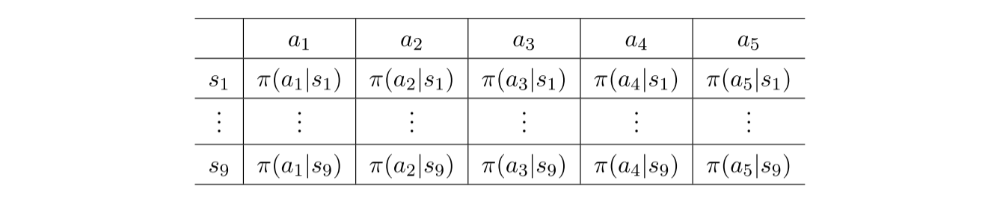

函数近似的思想不仅可以用于表示状态/行动值(第8章所述)，还可用于表示策略(如本章所述)。本书此前介绍的策略均采用表格形式表示：所有状态的行动概率存储于表格中(例如表$9.1$)。本章将证明策略可通过参数化函数表示为$\pi(a|s, \theta)$，其中$\theta \in \mathbb{R}^m$为参数向量。该函数亦可表示为其他形式，如$\pi_\theta(a|s)$、$\pi_\theta(a, s)$或$\pi(a,s,\theta)$。

当策略被表示为函数时，最优策略可通过优化特定标量指标获得。此类方法称为策略梯度法(policy gradient)。策略梯度方法在本书中是一大进步，因为它是基于策略的(policy-based)。相比之下，本书前几章讨论的都是基于价值的方法(value-based)。策略梯度方法的优势众多，例如：它能更高效地处理大规模状态/行动空间；其泛化能力更强，因此在样本利用效率上更具优势。

 

 > 表$9.1$：策略的表格化表示。该表包含$9$个状态，每个状态对应$5$个行动。

